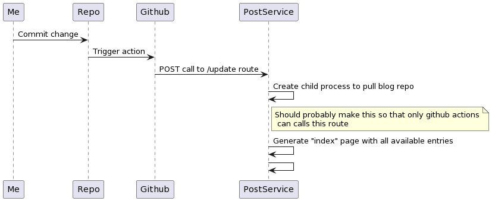

# Building a blog (part 3): Return of the think

Alright so part 2 was short, let's get to business.

We already said that we'd be using express to serve the markdown files, which is fine and dandy.  Now for the actual server behavior.

The server should be publicly available (so we can provide things like 'read this in markdown!') and provide the raw file. 

Easily done, now how to update the files _on_ the server whenever we commit a change, and how do we do this dynamically without having to restart the service every time it happens.

Here's _another_ diagram! 

```
Me (me)
Repo (github repo)
PostService (service that serves the md files)
```


In a nutshell, I'll commit my entries to the repo, a github action will do a post command to the service which will trigger a routine that can only pull the repo to the server en update the files. When that is done a function will generate an index from the github repo. And _voila_ serving files will be done. This way the react part of the website is only a shell app that loads information for an information providing service.

Should be easy right?

_Famous last words_.
